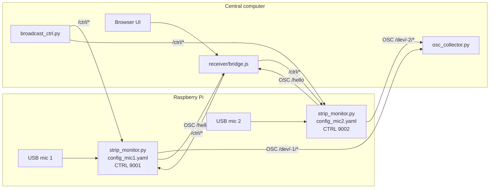

# Speech Record Analysis

Raspberry Pi speech-analysis pipeline for live microphone capture, acoustic feature extraction, optional emotion inference, OSC telemetry, CSV logging, and browser-based monitoring.

The repository is intended to be copied or cloned onto one or more Raspberry Pis. Each Pi can run one or two microphone processes. A central computer can collect OSC streams, display live status, send control commands, and gather CSV logs.

## First-Time Checklist

Use this order for a new Pi and a new operator:

1. Clone or copy this repository to the Pi as `~/SPEECH_RECORD_ANALYSIS`.
2. Run `bash setup_pi.sh` on the Pi. This installs apt packages, creates `venv/`, and installs the Python packages.
3. Activate the venv with `source venv/bin/activate`.
4. Run `python strip_monitor.py --list-devices` and write down the microphone names or indices.
5. Copy the microphone templates: `cp config_mic1.example.yaml config_mic1.yaml` and, for two mics, `cp config_mic2.example.yaml config_mic2.yaml`.
6. Edit `pi_id`, `mic_id`, `audio_device`, and `ctrl_port` in the local config files.
7. Cache the emotion model once with `python download_models.py seed` or `python download_models.py base` while the Pi has internet access.
8. Start one mic with `./start_audio_server.sh --config config_mic1.yaml`, or two mics with `./start_two_mics.sh`.
9. On the central computer, run `./run_web.sh` to open the browser receiver.

The local files `config_mic1.yaml` and `config_mic2.yaml` are deliberately not tracked by git. The tracked `.example.yaml` files are the examples to copy and edit for each Pi.

## System Overview



## Processing Pipeline

- Audio capture: `sounddevice` / PortAudio, one process per microphone.
- Resampling: microphone-native sample rate to 16 kHz mono with `scipy.signal.resample_poly`.
- VAD: Silero VAD through PyTorch, CPU runtime.
- Prosody: openSMILE `eGeMAPSv02` low-level descriptors.
- Emotion: FunASR emotion2vec, using either `base` or `seed` model.
- Output: OSC telemetry and optional local CSV files.
- Control: OSC `/ctrl/...` messages for streaming, logging, and processing-stage toggles.

## Repository Layout

| Path | Purpose |
| --- | --- |
| `strip_monitor.py` | Main one-microphone runtime process. |
| `audio_analysis_background.py` | Headless single-stream launcher wrapper. |
| `config.yaml` | Default single-microphone configuration. |
| `config_mic1.example.yaml`, `config_mic2.example.yaml` | Templates for two-microphone Pi deployments. |
| `download_models.py` | Optional one-time model-cache warmup script. |
| `setup_pi.sh` | Installs system packages, creates `venv/`, installs Python dependencies. |
| `start_audio_server.sh` | Starts one `strip_monitor.py` process from the local venv. |
| `start_two_mics.sh`, `stop_two_mics.sh` | Starts/stops two microphone processes on one Pi. |
| `diag_audio.py` | Captures a short diagnostic sample and checks resampling plus VAD. |
| `osc_collector.py` | Central OSC collector that writes CSV files. |
| `broadcast_ctrl.py` | Sends one control command to multiple discovered devices. |
| `gather_logs.sh` | Copies Pi-side `output/` folders back to the central computer. |
| `receiver/` | Node.js OSC-to-WebSocket bridge and browser UI. |
| `src/` | Audio, VAD, prosody, emotion, MIDI, and CSV helper modules. |
| `models/` | Optional project-local emotion2vec model cache. |

## Raspberry Pi Setup

Use Raspberry Pi OS 64-bit on a Pi 4 or Pi 5. A Pi 5 or a Pi 4 with at least 4 GB RAM is recommended when loading the emotion model.

Required Pi-side system packages are installed by `setup_pi.sh`:

- `python3-venv`, `python3-pip`, `python3-dev`
- `portaudio19-dev`, `libportaudio2`
- `libsndfile1`
- `ffmpeg`
- `git`, `build-essential`

Required Pi-side Python packages are listed in `requirements-pi.txt` and installed by the same script. The main packages are `numpy`, `sounddevice`, `PyYAML`, `funasr`, `torch`, `torchaudio`, `modelscope`, `opensmile`, `python-osc`, `mido`, and `psutil`.

```bash
sudo apt update && sudo apt upgrade -y
sudo apt install -y git
git clone <repo-url> ~/SPEECH_RECORD_ANALYSIS
cd ~/SPEECH_RECORD_ANALYSIS
bash setup_pi.sh
```

Activate the environment after setup:

```bash
cd ~/SPEECH_RECORD_ANALYSIS
source venv/bin/activate
```

The setup script is safe to run again. It will reuse the existing `venv/` and update/install missing Python packages.

## Microphone Configuration

List available input devices:

```bash
python strip_monitor.py --list-devices
```

Example output may look like this:

```text
Available audio input devices:
  [1]   USB PnP Sound Device  (in=1, sr=48000)
  [2]   HK-MIC1               (in=1, sr=48000)
  [3]   HK-MIC2               (in=1, sr=48000)
```

You can use either the number (`2`) or a unique name substring (`HK-MIC1`) as `audio_device`.

For a single microphone, edit `config.yaml`:

```yaml
pi_id: null
mic_id: 1
audio_device: null
osc_ip: '127.0.0.1'
osc_port: 9000
ctrl_port: 9001
```

For two microphones, create local config files from the templates:

```bash
cp config_mic1.example.yaml config_mic1.yaml
cp config_mic2.example.yaml config_mic2.yaml
```

Then edit each local file:

- `pi_id`: numeric Pi identity, or `null` to derive identity from hostname.
- `mic_id`: `1` or `2`.
- `audio_device`: integer device index or substring of the input device name.
- `ctrl_port`: `9001` for mic 1, `9002` for mic 2.

The local files `config_mic1.yaml` and `config_mic2.yaml` are ignored by git because they are hardware-specific.

Concrete example for a Pi with ID `5`, two USB microphones, and the central receiver at `192.168.1.20`:

```yaml
# config_mic1.yaml
pi_id: 5
mic_id: 1
audio_device: "HK-MIC1"
ctrl_port: 9001
osc_ip: "192.168.1.20"
osc_port: 9000
emotion_model: "seed"
emotion_load: true
vad_active: false
prosody_active: false
emotion_active: false
osc_active: false
log_active: false
output_dir: "output"
```

```yaml
# config_mic2.yaml
pi_id: 5
mic_id: 2
audio_device: "HK-MIC2"
ctrl_port: 9002
osc_ip: "192.168.1.20"
osc_port: 9000
emotion_model: "seed"
emotion_load: true
vad_active: false
prosody_active: false
emotion_active: false
osc_active: false
log_active: false
output_dir: "output"
```

The `osc_ip` value is the IP address of the central computer running `run_web.sh` or `osc_collector.py`. If you only want to test locally on the Pi, keep `osc_ip: "127.0.0.1"`.

## Running On The Pi

Single microphone:

```bash
./start_audio_server.sh --config config.yaml
```

Two microphones:

```bash
./start_two_mics.sh
tail -f logs/mic1.log logs/mic2.log
```

Stop two microphone processes:

```bash
./stop_two_mics.sh
```

Manual run with command-line overrides:

```bash
source venv/bin/activate
python strip_monitor.py --config config.yaml --device "USB PnP" --osc-ip 192.168.1.20 --osc-port 9000
```

## Central Receiver

On the central computer:

```bash
cd SPEECH_RECORD_ANALYSIS
./run_web.sh
```

This installs Node dependencies on first run, starts `receiver/bridge.js`, and opens:

```text
http://localhost:3000
```

Bridge defaults:

- OSC UDP input from Pis: `9000`
- Browser WebSocket: `8765`
- Browser HTTP server: `3000`

Central receiver dependencies:

- Node.js and `npm` must already be installed on the central computer.
- `./run_web.sh` runs `npm install` inside `receiver/` the first time it sees no `receiver/node_modules/` folder.
- Receiver JavaScript dependencies are declared in `receiver/package.json` and pinned in `receiver/package-lock.json`.

## Central CSV Collection

Run the OSC collector on the central computer:

```bash
source venv/bin/activate
python osc_collector.py --host 0.0.0.0 --port 9000 --out output
```

Each discovered device writes a separate CSV stream under `output/`.

To copy CSV logs from Pis after a run:

```bash
./gather_logs.sh output/session_001 pi1.local pi2.local
```

If the repository lives at a different path on the Pi, pass it explicitly:

```bash
./gather_logs.sh --remote-path SPEECH_RECORD_ANALYSIS/output/ output/session_001 pi1.local
```

## Control Commands

Each `strip_monitor.py` instance listens for OSC control messages on its configured `ctrl_port`.

Common controls:

| Address | Arguments | Effect |
| --- | --- | --- |
| `/ctrl/osc_start` | none | Start OSC telemetry. |
| `/ctrl/osc_stop` | none | Stop OSC telemetry. |
| `/ctrl/log_start` | optional run id / timestamp | Start local CSV logging. |
| `/ctrl/log_stop` | none | Stop local CSV logging. |
| `/ctrl/vad_on`, `/ctrl/vad_off` | none | Toggle VAD. |
| `/ctrl/prosody_on`, `/ctrl/prosody_off` | none | Toggle prosody extraction. |
| `/ctrl/emotion_on`, `/ctrl/emotion_off` | none | Toggle emotion inference if the model was loaded at startup. |

`broadcast_ctrl.py` can fan out the same command to multiple discovered devices.

## Emotion Models

The code looks for emotion2vec models in this order:

1. `models/<model_id>/`
2. `~/.cache/modelscope/hub/models/<model_id>/`
3. ModelScope online download

This means the model is not downloaded on every run. The first run that needs a missing model downloads it into the ModelScope cache; later runs load the cached files. If you place the model under `models/`, this repository-local copy is used first.

Supported variants:

| Config value | ModelScope ID | Notes |
| --- | --- | --- |
| `base` | `iic/emotion2vec_plus_base` | Larger model, better default quality. |
| `seed` | `iic/emotion2vec_plus_seed` | Smaller model for lower-memory deployments. |

For low-memory Pis, set this in the YAML before launch:

```yaml
emotion_model: 'seed'
emotion_load: false
```

When `emotion_load: false`, the process does not load the model and emotion processing cannot be enabled later in that same process.

Recommended first-time model setup:

```bash
cd ~/SPEECH_RECORD_ANALYSIS
source venv/bin/activate
python download_models.py seed
```

Use `base` instead of `seed` when you want the larger default model:

```bash
python download_models.py base
```

To cache both:

```bash
python download_models.py seed base
```

After this, normal `strip_monitor.py` runs should print a cache/local loading message instead of downloading again.

For an offline Pi, prepare the model on a connected machine or another Pi, then copy the cached model folder into this repository:

```bash
mkdir -p models/iic
cp -r ~/.cache/modelscope/hub/models/iic/emotion2vec_plus_seed models/iic/
```

The expected project-local path for the seed model is:

```text
models/iic/emotion2vec_plus_seed/model.pt
```

## Diagnostics

Check capture, native sample rate, resampling, level, and VAD:

```bash
source venv/bin/activate
python diag_audio.py --device "USB" --seconds 10
```

Common checks:

- If device listing is empty, check USB connection and ALSA input visibility.
- If raw RMS is near zero, check the selected channel and microphone gain.
- If raw RMS is healthy but VAD is empty, check model download/loading and speech level.
- If ALSA rejects 16 kHz, keep native-rate resampling enabled. Do not use `--no-resample` unless the microphone supports 16 kHz directly.

## Git Notes

The repository intentionally ignores:

- `venv/`
- `receiver/node_modules/`
- `models/*` except `models/README.md`
- runtime `output/`, `logs/`, and CSV files
- local per-Pi configs `config_mic1.yaml` and `config_mic2.yaml`
