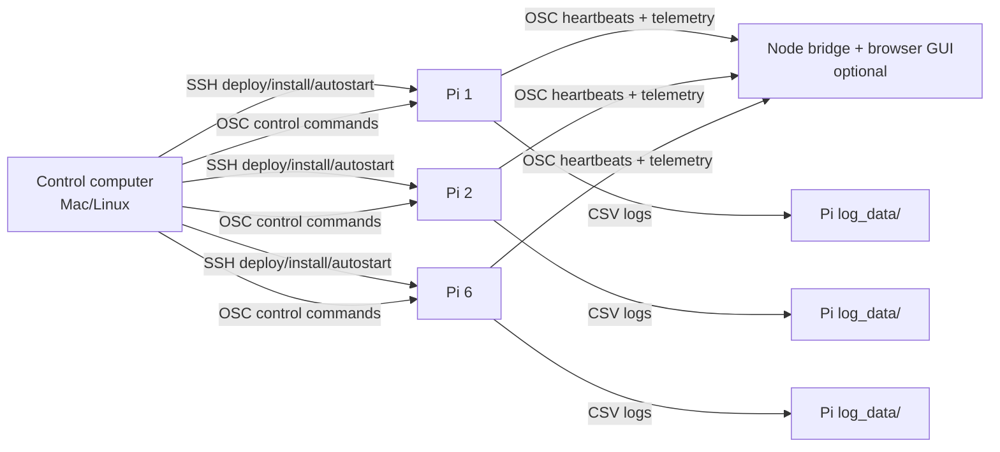

# Speech Record Analysis

Networked Raspberry Pi speech-recording and analysis system for multi-mic experiments. Each Pi runs microphone processes that capture audio, compute speech features, stream live OSC telemetry, and save session data locally. A separate control computer starts/stops recording sessions, verifies that the expected rig is alive, and optionally shows the live browser monitor.

The README explains the intended system model first. Detailed procedures live in the linked documents.

## 1. What The System Does

The system is designed for a small fleet of Raspberry Pis on the same network as a control computer. In the current lab setup, six Pis can each run two microphone processes, giving up to twelve live recording processes.

Each microphone process can provide:

- live audio capture from the configured microphone
- VAD timeline output
- prosody/openSMILE low-level descriptor output
- optional emotion inference output
- OSC telemetry for live monitoring
- Pi-local CSV logging for later analysis

Saved data in the current workflow includes feature-specific CSV files: `_opensmile_lld.csv`, `_vad.csv`, and `_emotion.csv`. These files share a simple alignable timing prefix (`frameTime`, `unix_start`, `unix_end`). For the logging, saving, and collection workflow, see [docs/central_collection.md](docs/central_collection.md). For openSMILE details, see [docs/openSmile_information.md](docs/openSmile_information.md).

Later documentation should add dedicated VAD and emotion-output references, similar to the existing openSMILE notes.

## 2. System Architecture

The Pis do the audio work. The control computer coordinates, monitors, deploys, and retrieves data.



Important roles:

- Raspberry Pis run `strip_monitor.py` microphone processes.
- The control computer runs `speech_control.py` commands and, optionally, `./run_web.sh` for the browser GUI bridge.
- The browser GUI is a monitor/control surface; it is not the audio-analysis engine.
- Recording results are saved on the Pis, normally under each Pi's configured `log_data/` directory, unless copied back later.

For script responsibilities, see [docs/script_map.md](docs/script_map.md).

## 3. Normal Operation After Deployment

Normal operation assumes the system has already been deployed.

In that deployed state:

- Each Pi has the project installed at `/home/pi/SPEECH_RECORD_ANALYSIS`.
- Each Pi has a Python `venv/`, local models, and real microphone config files.
- systemd user services start the microphone processes automatically at boot.
- Operators do not manually launch the mic processes on each Pi.
- The operator works from the control computer.

Typical operator flow on the control computer:

```bash
# 1. Verify that the expected Pi/mic processes are alive and healthy.
python speech_control.py test start_recording_session.yaml

# 2. Start the recording session if the test passes.
python speech_control.py start-recording-session start_recording_session.yaml

# 3. Pause/resume if needed.
python speech_control.py broadcast --session start_recording_session.yaml log_pause
python speech_control.py broadcast --session start_recording_session.yaml log_resume

# 4. Save the run.
python speech_control.py broadcast --session start_recording_session.yaml log_save_stop session_001.csv
```

For the full operator workflow, GUI option, dry runs, and Python integration examples, see [docs/operator_osc_control.md](docs/operator_osc_control.md).

## 4. Configuration Files

There are two different kinds of inventory files. Keeping them separate is intentional.

| File                                                                                                | Used On            | Purpose                                                                                                                   |
| --------------------------------------------------------------------------------------------------- | ------------------ | ------------------------------------------------------------------------------------------------------------------------- |
| `devices.csv`                                                                                       | control computer   | Deployment/autostart inventory: which Pis get installed or updated. Create or maintain this file before fleet deployment. |
| [start_recording_session.yaml](start_recording_session.yaml)                                        | control computer   | Recording-session inventory: which Pi/mic processes are expected and what processing commands are sent at session start.  |
| [config_mic1.yaml](config_mic1.yaml)                                                                | each Pi            | Runtime config for mic 1.                                                                                                 |
| [config_mic2.yaml](config_mic2.yaml)                                                                | each Pi            | Runtime config for mic 2.                                                                                                 |
| [config_features.yaml](config_features.yaml)                                                        | each Pi            | Shared feature/logging config for both mic processes.                                                                     |
| [config_local_mic1.yaml](config_local_mic1.yaml) / [config_local_mic2.yaml](config_local_mic2.yaml) | local test machine | One-machine test configs, intentionally different from real Pi configs.                                                   |

Typical ports:

- mic 1 control: `9001`
- mic 2 control: `9002`
- bridge/listener heartbeat path: UDP `9000`
- browser GUI HTTP: `http://localhost:3000/`

For Pi runtime config details and local-vs-real launcher differences, see [docs/pi_runtime_processing.md](docs/pi_runtime_processing.md).

## 5. Deployment And Installation

Deployment has two sides: the Raspberry Pi fleet and the control computer.

### 5.1 Raspberry Pi Fleet

Each deployed Pi should contain:

- `/home/pi/SPEECH_RECORD_ANALYSIS`
- `models/`
- `wheelhouse/` for offline Python package installation
- `venv/`
- [config_mic1.yaml](config_mic1.yaml), [config_mic2.yaml](config_mic2.yaml), and [config_features.yaml](config_features.yaml)
- systemd user services for `speech-record-mic1.service` and `speech-record-mic2.service`

At runtime, those services launch two `strip_monitor.py` processes, one per microphone. After autostart is enabled, do not run [START_AUDIO_PROCESSING.sh](START_AUDIO_PROCESSING.sh) manually on top of active services, because that can create duplicate processes.

Canonical fleet deployment guide:

- [docs/main_deployment.md](docs/main_deployment.md)

That guide covers the full intended flow:

1. Build the offline wheelhouse on one internet-connected Pi.
2. Copy the project bundle to all Pis over SSH.
3. Run [install_from_bundle.sh](install_from_bundle.sh) on all Pis.
4. Enable autostart services.
5. Validate that the deployed mic processes respond.

Autostart details are currently documented separately in [docs/pi_autostart_installation.md](docs/pi_autostart_installation.md). That file is useful as a systemd detail reference, but the main fleet deployment path should start from [docs/main_deployment.md](docs/main_deployment.md).

### 5.2 Control Computer

The control computer is the Mac/Linux machine used by the operator or deployer. It should have a local copy of this repository.

Required for operator/session commands:

- Python 3
- `python-osc`
- `PyYAML` recommended for full YAML parsing
- [speech_control.py](speech_control.py)
- [start_recording_session.yaml](start_recording_session.yaml)

Install Python dependencies if needed:

```bash
pip install python-osc PyYAML
```

Required for deployment/autostart scripts:

- SSH access to all Pis
- `paramiko` for [configure_auto_start.py](configure_auto_start.py)
- a deployment inventory file named `devices.csv`

Optional for the browser GUI:

- Node.js and npm
- [run_web.sh](run_web.sh)
- [receiver/](receiver/)

Start the GUI bridge from the control computer when visual monitoring is useful:

```bash
./run_web.sh --session start_recording_session.yaml
```

The GUI can show expected processes from [start_recording_session.yaml](start_recording_session.yaml) and live heartbeats from the Pis. Missing expected processes are shown as missing/red. This is useful before a recording session, but it is not required for headless command-line control.

### 5.3 Session YAML And Saved Results

[start_recording_session.yaml](start_recording_session.yaml) defines the expected recording rig for one session. It describes:

- which Pis participate
- which mic processes are expected on each Pi
- which processing stages are turned on before logging starts
- whether logging starts after the preflight passes

When a session is saved, each Pi writes files locally under its configured `output_dir`, normally `log_data/`. The save command automatically adds the Pi/mic id to the filename so multiple processes do not overwrite one another.

Copying saved session data back from all Pis to the control computer is an important follow-up workflow. A dedicated pull script or GUI action would be useful later; for now, use SSH/rsync or the existing log-gathering helpers described in the detailed docs.

## 6. Manual Modes, Testing, And Troubleshooting

This section is for bring-up and diagnostics, not normal deployed operation.

### 6.0 Fresh Local Reset Before Testing

When testing on the control computer, use [fresh_start_local.sh](fresh_start_local.sh)
as the canonical cleanup tool.

Recommended reset sequence:

```bash
./fresh_start_local.sh --dry-run
./fresh_start_local.sh
./run_web.sh --replace --session start_recording_session.yaml
```

Scope options when you do not want full cleanup:

- `./fresh_start_local.sh --mics-only`: stop only local `strip_monitor.py` processes
- `./fresh_start_local.sh --bridge-only`: stop only bridge/listener processes

Compatibility note:

- [stop_two_mics.sh](stop_two_mics.sh) now forwards to `./fresh_start_local.sh --mics-only`

What this avoids:

- hidden local heartbeat sources appearing as `local-*`
- old bridge processes keeping ports `9000`/`8765`/`3000`
- confusion where `--session` appears ignored because a stale bridge is still running

### 6.1 Manual Pi Launch Before Autostart

Use manual launch only before services are installed, or while debugging one Pi.

On the Pi:

```bash
cd /home/pi/SPEECH_RECORD_ANALYSIS
bash install_from_bundle.sh
./START_AUDIO_PROCESSING.sh
```

Inspect logs:

```bash
tail -f logs/mic1.log logs/mic2.log
```

Stop manual processes:

```bash
./stop_two_mics.sh
```

### 6.2 Local One-Machine Test Mode

The project has a separate local launcher for testing without the real Pi fleet:

```bash
./START_LOCAL_TEST_PROCESSING.sh
```

This uses [config_local_mic1.yaml](config_local_mic1.yaml) and [config_local_mic2.yaml](config_local_mic2.yaml), not the real Pi configs. These local configs are intentionally different and should not be confused with deployed runtime settings.

For a compact runbook covering both laptop-only tests and control-laptop + one-Pi tests, see [docs/quick_test_laptop_one_pi.md](docs/quick_test_laptop_one_pi.md).

### 6.3 Quick Diagnostics

Useful checks:

```bash
# On a Pi or local test machine: inspect audio device availability.
python diag_audio.py

# On the control computer: test the expected recording rig.
python speech_control.py test start_recording_session.yaml
```

For systemd service logs on a Pi:

```bash
journalctl --user -u speech-record-mic1.service -n 80 --no-pager
journalctl --user -u speech-record-mic2.service -n 80 --no-pager
```

For more runtime and troubleshooting details, see [docs/pi_runtime_processing.md](docs/pi_runtime_processing.md) and [docs/pi_autostart_installation.md](docs/pi_autostart_installation.md).

## 7. Detailed Documentation

| Topic                                                 | File                                                                   |
| ----------------------------------------------------- | ---------------------------------------------------------------------- |
| Operator recording commands and Python integration    | [docs/operator_osc_control.md](docs/operator_osc_control.md)           |
| Full Pi fleet deployment                              | [docs/main_deployment.md](docs/main_deployment.md)                     |
| Pi runtime config, manual launch, and diagnostics     | [docs/pi_runtime_processing.md](docs/pi_runtime_processing.md)         |
| Laptop-only and one-Pi quick test recipes             | [docs/quick_test_laptop_one_pi.md](docs/quick_test_laptop_one_pi.md)   |
| systemd autostart details                             | [docs/pi_autostart_installation.md](docs/pi_autostart_installation.md) |
| Script responsibilities and entrypoints               | [docs/script_map.md](docs/script_map.md)                               |
| Logging, saving, and collecting data                  | [docs/central_collection.md](docs/central_collection.md)               |
| openSMILE notes                                       | [docs/openSmile_information.md](docs/openSmile_information.md)         |

## 8. Notes On Documentation Organization

No file moves are required for current workflows. The README now acts as the system orientation document, while detailed procedures remain in separate workflow files.

Future cleanup could rename [docs/main_deployment.md](docs/main_deployment.md) to something like `docs/deployment_pi_fleet.md` and fold [docs/pi_autostart_installation.md](docs/pi_autostart_installation.md) into it as an advanced systemd appendix. That should be done only after reviewing links and avoiding unnecessary disruption.
