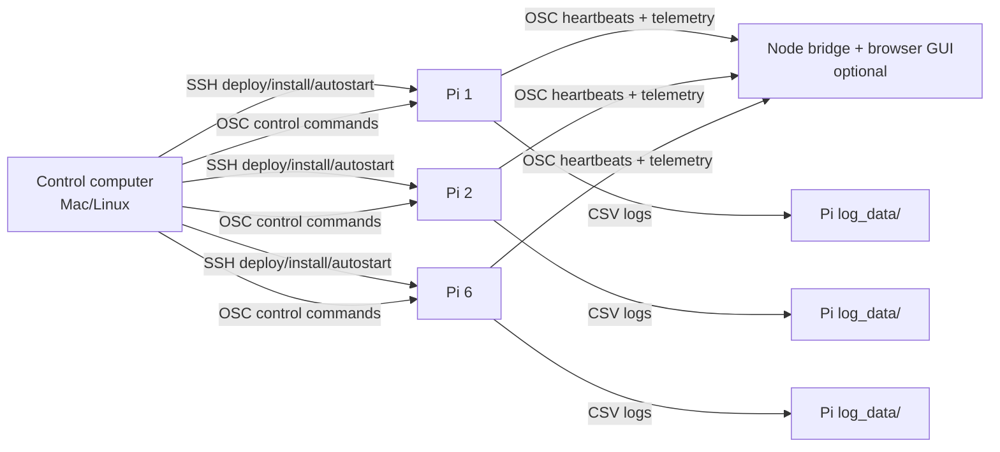

# Speech Record Analysis

Networked Raspberry Pi speech-recording and analysis system for HCI data collection. Each Pi runs one or more microphone processes that capture audio, compute speech features, stream live OSC telemetry to a main computer, and save session data in real time (later collected by the main computer). During runtime, the control computer starts/stops recording sessions, verifies that the expected rig is alive, and optionally shows a live browser monitor. File retrieval from the RPi in the network is also automated (ssh).

The README explains the intended system model first. Detailed procedures live in the linked documents.

## 1. What The System Does

The system is designed for a small fleet of Raspberry Pis on the same network as a control computer. In the current lab setup, six Pis can each run two microphone processes, giving up to twelve live recording processes.

The fleet is declared in two separate files. [devices.csv](devices.csv) lists which Pis get installed and updated during deployment. [start_recording_session.yaml](start_recording_session.yaml) lists which Pi/mic processes are expected for a specific recording session. Keeping them separate makes it possible to deploy the full fleet but record with a subset.

At runtime the system is broadcast-friendly: any additional `strip_monitor.py` process on the network — running on a spare Pi, a laptop, or any other host — announces itself via `/hello` heartbeats, appears in the live monitor, and can receive broadcast control commands, even if it is not listed in either file. Only the preflight `test` command is strict about the declared list (see Section 3).

Each microphone process can provide:

- live audio capture from the configured microphone
- VAD timeline output
- prosody/openSMILE low-level descriptor output
- optional emotion inference output
- OSC telemetry for live monitoring
- Pi-local CSV logging for later analysis

Saved data in the current workflow includes feature-specific CSV files: `_opensmile_lld.csv`, `_vad.csv`, and `_emotion.csv`. These files share a simple alignable timing prefix (`frameTime`, `unix_start`, `unix_end`). For the logging, saving, and collection workflow and full CSV schema, see [docs/Data_Collection_and_CSV_Format.md](docs/Data_Collection_and_CSV_Format.md). For openSMILE details, see [docs/openSmile_information.md](docs/openSmile_information.md).

[TO DO: add documentation files about VAD and emotion-output, similar to the existing openSMILE notes.]

## 2. System Architecture

The Pis do the audio work. The control computer coordinates, monitors, deploys, and retrieves data.



Important roles:

- Raspberry Pis run `strip_monitor.py` microphone processes (one per microphone).
- The control computer runs `speech_control.py` commands and, optionally, `./run_web.sh` for the browser GUI bridge.
- The browser GUI is a monitor/control surface; it is not the audio-analysis engine.
- Recording results are saved on the Pis, normally under each Pi's configured `log_data/` directory, and can be copied to the main computer later (real time, direct collection on the main computer through OSC is possible but not recommended).

For script responsibilities, see [docs/script_map.md](docs/script_map.md).

## 3. QUICK GUIDE (Normal Operation After Deployment)

Assumes deployment is done and both mic services autostart on each Pi. Every command below runs from the Mac in the repo root.

```bash
# All the operator commands live in speech_control.py. It has a shebang and is
# executable, so `./speech_control.py ...` is equivalent to `python speech_control.py ...`.

# 1. Preflight the expected rig.
#    `test` sends /ctrl/query_state to every Pi/mic listed in the session YAML
#    and reports OK / ERROR / TIMEOUT per process. Run this before every session.
python speech_control.py test start_recording_session.yaml

# 2. Start a recording session.
#    `start-recording-session` first runs the same preflight, then (only if it
#    passes) sends the startup commands declared in the YAML: vad_on / prosody_on /
#    emotion_on|off / osc_start / osc_send_hz / log_start.
python speech_control.py start-recording-session start_recording_session.yaml

# 3. Pause / resume during the run.
python speech_control.py broadcast --session start_recording_session.yaml log_pause
python speech_control.py broadcast --session start_recording_session.yaml log_resume

# 4. Save + pull files back to the Mac in one step.
python save_and_pull_logs.py --session start_recording_session.yaml take_001
```

Optional live monitoring in the browser:

```bash
./run_web.sh --session start_recording_session.yaml   # → http://localhost:3000/
```

<!-- TODO: add a screenshot of the browser GUI showing the expected rig, live heartbeats, and a healthy recording session. -->

**Canonical runtime guide: [docs/Runtime_Operation.md](docs/Runtime_Operation.md).** Covers pause/resume/discard, live monitoring, local one-machine tests, and runtime troubleshooting. For CSV/collection specifics: [docs/Data_Collection_and_CSV_Format.md](docs/Data_Collection_and_CSV_Format.md). For every OSC command and full session YAML: [docs/operator_osc_control.md](docs/operator_osc_control.md).

## 4. Configuration Files

There are two different kinds of inventory files. Keeping them separate is intentional.

| File                                                                                                | Used On            | Purpose                                                                                                                   |
| --------------------------------------------------------------------------------------------------- | ------------------ | ------------------------------------------------------------------------------------------------------------------------- |
| `devices.csv`                                                                                       | control computer   | Deployment/autostart inventory: which Pis get installed or updated. Create or maintain this file before fleet deployment. |
| [start_recording_session.yaml](start_recording_session.yaml)                                        | control computer   | Recording-session inventory: which Pi/mic processes are expected and what processing commands are sent at session start.  |
| [config_mic1.yaml](config_mic1.yaml)                                                                | each Pi            | Runtime config for mic 1.                                                                                                 |
| [config_mic2.yaml](config_mic2.yaml)                                                                | each Pi            | Runtime config for mic 2.                                                                                                 |
| [config_features.yaml](config_features.yaml)                                                        | each Pi            | Shared feature/logging config for both mic processes.                                                                     |
| [config_local_mic1.yaml](config_local_mic1.yaml) / [config_local_mic2.yaml](config_local_mic2.yaml) | local test machine | One-machine test configs, intentionally different from real Pi configs.                                                   |

Typical ports:

- mic 1 control: `9001`
- mic 2 control: `9002`
- bridge/listener heartbeat path: UDP `9000`
- browser GUI HTTP: `http://localhost:3000/`

For Pi runtime config details and local-vs-real launcher differences, see [docs/pi_runtime_processing.md](docs/pi_runtime_processing.md).

## 5. Deployment And Installation

Deployment has two sides: the Raspberry Pi fleet and the control computer.

### 5.1 Raspberry Pi Fleet

Each deployed Pi should contain:

- `/home/pi/SPEECH_RECORD_ANALYSIS`
- `models/`
- `wheelhouse/` for offline Python package installation
- `venv/`
- [config_mic1.yaml](config_mic1.yaml), [config_mic2.yaml](config_mic2.yaml), and [config_features.yaml](config_features.yaml)
- systemd user services for `speech-record-mic1.service` and `speech-record-mic2.service`

At runtime, those services launch two `strip_monitor.py` processes, one per microphone. After autostart is enabled, do not run [START_AUDIO_PROCESSING.sh](START_AUDIO_PROCESSING.sh) manually on top of active services, because that can create duplicate processes.

**Canonical fleet deployment guide: [docs/Fleet_Deployment_Guide.md](docs/Fleet_Deployment_Guide.md).**

The guide is split into four phase-specific documents, one per stage:

1. [Bundle_Preparation_on_Builder_Pi.md](docs/Bundle_Preparation_on_Builder_Pi.md) — build `wheelhouse/` + `debs/` on an internet-connected builder Pi, pull to the Mac.
2. [Test_Deployment_on_One_Pi.md](docs/Test_Deployment_on_One_Pi.md) — push the bundle to one fleet Pi and verify audio + OSC end-to-end.
3. [Fleet_Deployment_via_SSH.md](docs/Fleet_Deployment_via_SSH.md) — roll the same bundle to all six Pis.
4. [Autostart_Configuration_on_Fleet.md](docs/Autostart_Configuration_on_Fleet.md) — opt-in systemd user services, run **only** after Phases 1–3 pass.

Start with [Fleet_Deployment_Guide.md](docs/Fleet_Deployment_Guide.md); it explains why each phase exists and links out to the four detailed docs above.

### 5.2 Control Computer

The control computer is the Mac/Linux machine used by the operator or deployer. It should have a local copy of this repository.

Required for operator/session commands:

- Python 3
- `python-osc`
- `PyYAML` recommended for full YAML parsing
- [speech_control.py](speech_control.py)
- [start_recording_session.yaml](start_recording_session.yaml)

Install Python dependencies if needed:

```bash
pip install python-osc PyYAML
```

Required for deployment/autostart scripts:

- SSH access to all Pis
- `paramiko` for [configure_auto_start.py](configure_auto_start.py)
- a deployment inventory file named `devices.csv`

Optional for the browser GUI:

- Node.js and npm
- [run_web.sh](run_web.sh)
- [receiver/](receiver/)

Start the GUI bridge from the control computer when visual monitoring is useful:

```bash
./run_web.sh --session start_recording_session.yaml
```

The GUI can show expected processes from [start_recording_session.yaml](start_recording_session.yaml) and live heartbeats from the Pis. Missing expected processes are shown as missing/red. This is useful before a recording session, but it is not required for headless command-line control.

<!-- TODO: add a screenshot of the GUI's expected-vs-live panel highlighting a missing Pi in red. -->

### 5.3 Session YAML And Saved Results

[start_recording_session.yaml](start_recording_session.yaml) defines the expected recording rig for one session. It describes:

- which Pis participate
- which mic processes are expected on each Pi
- which processing stages are turned on before logging starts
- whether logging starts after the preflight passes

When a session is saved, each Pi writes files locally under its configured `output_dir`, normally `log_data/`. The save command automatically adds the Pi/mic id to the filename so multiple processes do not overwrite one another.

Copying saved session data back from all Pis to the control computer is an important follow-up workflow. A dedicated pull script or GUI action would be useful later; for now, use SSH/rsync or the existing log-gathering helpers described in the detailed docs.

## 6. Manual Modes, Testing, And Troubleshooting

Not part of normal operation. Use only for bring-up, single-Pi debugging, or laptop-only development.

Quick cheats:

```bash
# Local one-machine test (Mac only, no fleet).
# Uses config_local_mic1.yaml (system default input, so whatever mic macOS routes
# to the terminal) and config_local_mic2.yaml (audio_device: 'MIC2', intentionally
# absent on most laptops so the GUI shows an "expected but failing" second stream).
# Emotion inference is disabled in the local configs for lighter startup.
# To see which input devices your machine actually exposes:
#     source venv/bin/activate && python strip_monitor.py --list-devices
./START_LOCAL_TEST_PROCESSING.sh

# Fresh reset of local mic + bridge processes before re-launching the GUI/receiver.
./fresh_start_local.sh
./run_web.sh --replace --session start_recording_session.yaml

# On a Pi, manually run the two-mic pipeline (only if autostart is NOT enabled).
# For example, targeting Pi #1 in the fleet (rpi5-11 at 192.168.0.11); the SSH
# username `pi` is the default account on Raspberry Pi OS, not a hostname.
ssh pi@192.168.0.11
cd /home/pi/SPEECH_RECORD_ANALYSIS && ./START_AUDIO_PROCESSING.sh

# Audio device diagnostic (Pi or Mac).
python diag_audio.py

# systemd service logs on a Pi.
journalctl --user -u speech-record-mic1.service -n 80 --no-pager
```

Full detail (fresh-reset scopes, one-machine vs one-Pi recipes, GUI diagnostics, common failures + fixes) is in [docs/Runtime_Operation.md](docs/Runtime_Operation.md) and [docs/quick_test_laptop_one_pi.md](docs/quick_test_laptop_one_pi.md).

## 7. Detailed Documentation

Two authoritative guides own the two workflows. Everything else is a reference linked from those.

| Topic                                          | File                                                                             |
| ---------------------------------------------- | -------------------------------------------------------------------------------- |
| Full Pi fleet deployment (4 phases)            | [docs/Fleet_Deployment_Guide.md](docs/Fleet_Deployment_Guide.md)                 |
| Runtime operation, sessions, monitoring, tests | [docs/Runtime_Operation.md](docs/Runtime_Operation.md)                           |
| Data collection protocol + CSV file schema     | [docs/Data_Collection_and_CSV_Format.md](docs/Data_Collection_and_CSV_Format.md) |
| Operator OSC commands + full session YAML      | [docs/operator_osc_control.md](docs/operator_osc_control.md)                     |
| Per-Pi runtime config internals                | [docs/pi_runtime_processing.md](docs/pi_runtime_processing.md)                   |
| Laptop-only and one-Pi test recipes            | [docs/quick_test_laptop_one_pi.md](docs/quick_test_laptop_one_pi.md)             |
| Script responsibilities and entrypoints        | [docs/script_map.md](docs/script_map.md)                                         |
| openSMILE column reference                     | [docs/openSmile_information.md](docs/openSmile_information.md)                   |
