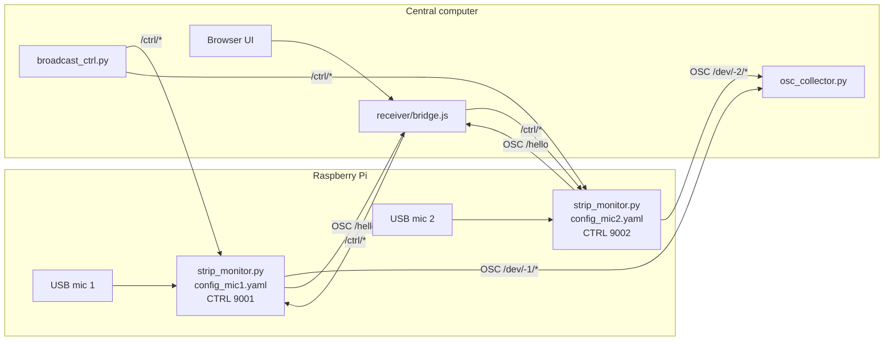
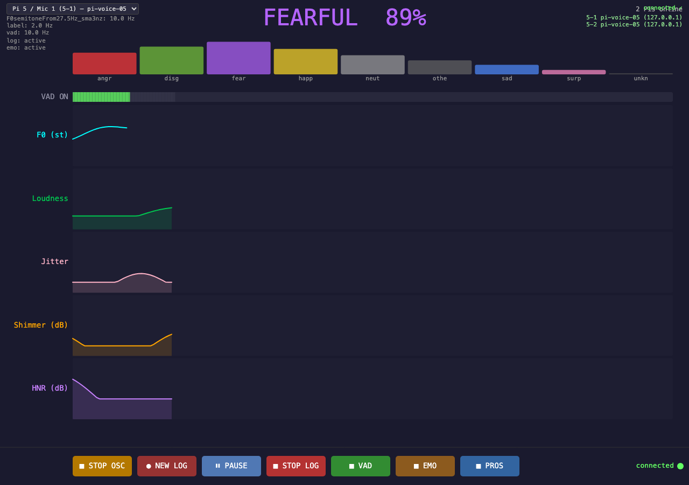
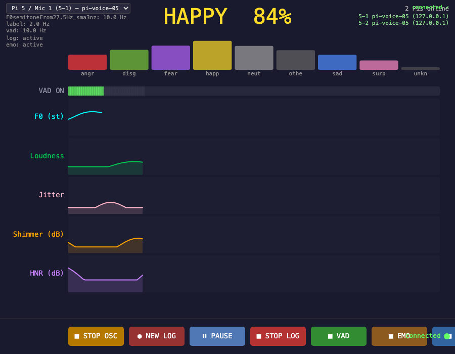

# Speech Record Analysis

Raspberry Pi speech-analysis pipeline for live microphone capture, acoustic feature extraction, optional emotion inference, OSC telemetry, CSV logging, and browser-based monitoring.

This project is meant to be installed on one or more Raspberry Pis. Each Pi runs the audio analysis process for one or two microphones. A separate central computer can run the browser monitor, receive OSC streams, send control commands, and gather CSV logs.

There are two different audiences for this document:

- **Operator**: receives a prepared USB drive and installs/runs the system on Pis.
- **USB preparer / developer**: prepares that USB drive by adding model files and an offline Python `wheelhouse/`.

Do not run the project directly from the USB drive during an actual session. Copy it to the Pi first so each Pi has its own local working folder, local configuration, logs, and model cache.

## Table Of Contents

Operator install and run:

- [1. What Runs Where](#1-what-runs-where)
- [2. Operator Path: Install From Prepared USB](#2-operator-path-install-from-prepared-usb)
- [7. Microphone Configuration](#7-microphone-configuration)
- [8. Running On The Pi](#8-running-on-the-pi)
- [9. Central Receiver](#9-central-receiver)

USB preparer only:

- [3. USB Preparer Path: Build The Offline Bundle](#3-usb-preparer-path-build-the-offline-bundle)
- [13. USB Preparation Details: Offline Python Dependencies](#13-usb-preparation-details-offline-python-dependencies)
- [14. USB Preparation Details: VAD And openSMILE](#14-usb-preparation-details-vad-and-opensmile)

Reference and troubleshooting:

- [4. System Overview](#4-system-overview)
- [5. Processing Pipeline](#5-processing-pipeline)
- [6. Repository Layout](#6-repository-layout)
- [10. Central CSV Collection](#10-central-csv-collection)
- [Central Collection, CSV Logs, And Data Meaning](docs/central_collection.md)
- [PDF copy of this README](docs/pdf/README.pdf)
- [PDF copy of the central collection guide](docs/pdf/central_collection.pdf)
- [11. Control Commands](#11-control-commands)
- [12. Emotion Models](#12-emotion-models)
- [15. Raspberry Pi Setup Reference](#15-raspberry-pi-setup-reference)
- [16. Diagnostics](#16-diagnostics)
- [17. Git Notes](#17-git-notes)

## 1. What Runs Where

| Machine                     | What it runs                                           | Typical command                                     |
| --------------------------- | ------------------------------------------------------ | --------------------------------------------------- |
| Raspberry Pi, one mic       | One `strip_monitor.py` process                         | `./start_audio_server.sh --config config_mic1.yaml` |
| Raspberry Pi, two mics      | Two `strip_monitor.py` processes, one per microphone   | `./start_two_mics.sh`                               |
| Central computer            | Browser receiver and OSC-to-WebSocket bridge           | `./run_web.sh`                                      |
| Central computer, optional  | CSV collector or log-gathering after a run             | `python osc_collector.py ...` / `gather_logs.sh`    |
| External drive or USB stick | Installer bundle only; used as the source to copy from | no long-running process                             |

## 2. Operator Path: Install From Prepared USB

Use this section when you already have a prepared USB drive. The operator should not need to build models, prepare wheels, or understand the Python dependency bundle.

Recommended drive layout:

```text
ExternalDrive/
  SPEECH_RECORD_ANALYSIS/
    README.md
    install_from_bundle.sh
    setup_pi.sh
    requirements-pi.txt
    wheelhouse/                   # required for offline Python package install
    config_mic1.example.yaml
    config_mic2.example.yaml
    models/
      silero-vad/                  # required for offline VAD loading
      iic/
        emotion2vec_plus_base/     # included in the current prepared bundle
        emotion2vec_plus_seed/     # optional, only if a real model.pt is present
```

Install on each Pi:

1. Give the Pi a unique hostname if `pi_id` will be left as `null` in the config. The Linux username can stay as-is.
2. Plug the USB drive into the Raspberry Pi.
3. Open a terminal on the Pi and list the mounted USB drives:

```bash
ls /media/$USER
```

The names printed there are the mounted drives. If more than one appears, look for the one that contains the prepared project folder:

```bash
ls /media/$USER/<drive-name>
```

The right drive should show `SPEECH_RECORD_ANALYSIS`. You can also run `lsblk -f` to see the USB drive label, size, and mount point. In the examples below, replace `INSTALL_DRIVE` with the exact folder name shown under `/media/$USER`.

4. Copy the prepared folder from the USB drive to the Pi. The recommended destination is the Pi user's home folder:

```text
/home/<pi-user>/SPEECH_RECORD_ANALYSIS
```

In shell commands this is written as `~/SPEECH_RECORD_ANALYSIS`. In the Raspberry Pi graphical file manager, open the user's **Home** folder and drop the whole `SPEECH_RECORD_ANALYSIS` folder there, so it appears next to folders such as `Desktop`, `Documents`, and `Downloads`. Do not drop it inside `Desktop`, `Documents`, or `Downloads` unless you also adjust the terminal commands later.

Keeping the project in the user's home folder is convenient because the Pi user can write local config files, logs, model cache files, and the Python `venv/` there without special permissions.

This example assumes the drive name is `INSTALL_DRIVE`:

```bash
cp -a /media/$USER/INSTALL_DRIVE/SPEECH_RECORD_ANALYSIS ~/SPEECH_RECORD_ANALYSIS
cd ~/SPEECH_RECORD_ANALYSIS
```

5. Run the prepared-bundle installer:

```bash
./install_from_bundle.sh
```

6. Activate the Python environment:

```bash
source venv/bin/activate
```

7. List microphones and write down the device names or indices:

```bash
python strip_monitor.py --list-devices
```

8. Edit `pi_id`, `mic_id`, `audio_device`, `ctrl_port`, and `osc_ip` in `config_mic1.yaml`; see [7. Microphone Configuration](#7-microphone-configuration) for what each field means and examples. For a two-microphone Pi, edit `config_mic2.yaml` too.
9. Start one mic with `./start_audio_server.sh --config config_mic1.yaml`, or two mics with `./start_two_mics.sh`.
10. On the central computer, run `./run_web.sh` to open the browser receiver; see [9. Central Receiver](#9-central-receiver) for what the central computer does and does not need to know.

Replace `INSTALL_DRIVE` with whatever name appeared when you ran `ls /media/$USER`. The `~` symbol means the current user's home folder, so the destination becomes `/home/<username>/SPEECH_RECORD_ANALYSIS`.

Avoid copying the project into system folders such as `/usr/local/` or `/opt/` unless you deliberately want to manage permissions and service setup yourself. For this handoff workflow, the home-folder path is simpler and safer.

If the destination already exists and you want a fresh copy, move the old folder aside first:

```bash
mv ~/SPEECH_RECORD_ANALYSIS ~/SPEECH_RECORD_ANALYSIS_old_$(date +%Y%m%d_%H%M%S)
cp -a /media/$USER/INSTALL_DRIVE/SPEECH_RECORD_ANALYSIS ~/SPEECH_RECORD_ANALYSIS
```

`install_from_bundle.sh` creates `config_mic1.yaml` and `config_mic2.yaml` from the templates if they are missing. These local files are deliberately not tracked by git because each Pi can have different microphone device names, Pi identity, and central-computer IP address.

If the bundle is missing `models/` or `wheelhouse/`, `install_from_bundle.sh` stops with a clear error and tells the operator what to ask the USB preparer for. If the Pi is missing required apt packages such as `portaudio19-dev`, `libsndfile1`, or `ffmpeg`, it also stops with a clear error. A completely offline Pi therefore needs either a prepared OS image with those apt packages already installed, or a one-time connected setup before the offline session.

## 3. USB Preparer Path: Build The Offline Bundle

Use this section when you are preparing the USB drive for someone else. The goal is that the operator can later follow only section 2.

The actual code is the whole `SPEECH_RECORD_ANALYSIS/` repository folder. Start from a fresh GitHub clone or a copy of this project folder, then add the offline-only folders `models/` and `wheelhouse/` inside it.

The prepared USB bundle should look like this. The list below is abbreviated; the important point is that the normal code files are present at the top level alongside the offline assets.

```text
SPEECH_RECORD_ANALYSIS/
  README.md
  strip_monitor.py
  setup_pi.sh
  install_from_bundle.sh
  prepare_wheelhouse.sh
  requirements-pi.txt
  config_mic1.example.yaml
  config_mic2.example.yaml
  src/
  receiver/
  docs/
  models/                       # added by the USB preparer, not downloaded by the operator
    iic/emotion2vec_plus_base/model.pt
    silero-vad/
  wheelhouse/                   # added by the USB preparer on a connected Raspberry Pi
    *.whl
```

In other words, do not create a USB drive that contains only `models/` and `wheelhouse/`. The operator needs the scripts and Python code too. The repository folder that goes onto the USB drive must include the model folders above. If they are missing, see sections 12 and 14 for the emotion2vec and VAD copy details. `wheelhouse/` must be built once on a connected Raspberry Pi with the same OS and Python version as the offline Pis.

To finish preparing the USB bundle on a connected Pi:

1. Copy `SPEECH_RECORD_ANALYSIS/` from the USB drive onto the connected Pi:

```bash
cp -a /media/$USER/INSTALL_DRIVE/SPEECH_RECORD_ANALYSIS ~/SPEECH_RECORD_ANALYSIS
cd ~/SPEECH_RECORD_ANALYSIS
```

2. Build the Raspberry-Pi-compatible wheelhouse:

```bash
./prepare_wheelhouse.sh
```

3. Copy the finished `wheelhouse/` back into the USB drive's copy of the repository:

```bash
cp -a ~/SPEECH_RECORD_ANALYSIS/wheelhouse /media/$USER/INSTALL_DRIVE/SPEECH_RECORD_ANALYSIS/
```

4. Optional: test the completed bundle on the connected Pi:

```bash
cd ~/SPEECH_RECORD_ANALYSIS
./install_from_bundle.sh
```

Replace `INSTALL_DRIVE` with the name printed by `ls /media/$USER` on that Pi. After step 3, the USB folder is the complete prepared bundle for the other Pis.

## 4. System Overview



## 5. Processing Pipeline

- Audio capture: `sounddevice` / PortAudio, one process per microphone.
- Resampling: microphone-native sample rate to 16 kHz mono with `scipy.signal.resample_poly`.
- VAD: Silero VAD through PyTorch, CPU runtime.
- Prosody: openSMILE `eGeMAPSv02` low-level descriptors.
- Emotion: FunASR emotion2vec, using either `base` or `seed` model.
- Output: OSC telemetry and optional local CSV files.
- Control: OSC `/ctrl/...` messages for streaming, logging, and processing-stage toggles.

## 6. Repository Layout

The repository is not physically split into `RaspberryPi/` and `CentralComputer/` folders. Instead, the launch scripts live at the top level, and the `receiver/` folder contains the central-computer browser interface. This keeps copy/install commands simple while still allowing the same repository folder to be used on a Pi or on the central computer.

| Path                                                   | Purpose                                                            |
| ------------------------------------------------------ | ------------------------------------------------------------------ |
| `strip_monitor.py`                                     | Pi-side one-microphone runtime process.                            |
| `audio_analysis_background.py`                         | Headless single-stream launcher wrapper.                           |
| `config.yaml`                                          | Default single-microphone configuration.                           |
| `config_mic1.example.yaml`, `config_mic2.example.yaml` | Templates for two-microphone Pi deployments.                       |
| `download_models.py`                                   | Pi-side optional one-time model-cache warmup script.               |
| `setup_pi.sh`                                          | Pi-side installer: apt packages, `venv/`, Python dependencies.     |
| `start_audio_server.sh`                                | Pi-side launcher for one `strip_monitor.py` process.               |
| `start_two_mics.sh`, `stop_two_mics.sh`                | Pi-side launch/stop scripts for two microphone processes.          |
| `diag_audio.py`                                        | Captures a short diagnostic sample and checks resampling plus VAD. |
| `osc_collector.py`                                     | Central-computer OSC collector that writes CSV files.              |
| `broadcast_ctrl.py`                                    | Central-computer script to control multiple discovered devices.    |
| `gather_logs.sh`                                       | Central-computer script to copy Pi-side `output/` folders back.    |
| `receiver/`                                            | Central-computer Node.js OSC-to-WebSocket bridge and browser UI.   |
| `src/`                                                 | Audio, VAD, prosody, emotion, MIDI, and CSV helper modules.        |
| `models/`                                              | Optional project-local emotion2vec and Silero VAD model cache.     |

## 7. Microphone Configuration

Run this section on the Pi after installation has finished and the venv is active.

List available input devices:

```bash
python strip_monitor.py --list-devices
```

Example output may look like this:

```text
Available audio input devices:
  [1]   USB PnP Sound Device  (in=1, sr=48000)
  [2]   HK-MIC1               (in=1, sr=48000)
  [3]   HK-MIC2               (in=1, sr=48000)
```

You can use either the number (`2`) or a unique name substring (`HK-MIC1`) as `audio_device`.

For an operator install, use `config_mic1.yaml` even when the Pi has only one microphone. `install_from_bundle.sh` creates this file from `config_mic1.example.yaml` if it is missing:

```yaml
pi_id: null
mic_id: 1
audio_device: null
osc_ip: '127.0.0.1'
osc_port: 9000
ctrl_port: 9001
```

For two microphones, use both local config files. If they do not exist yet, create them from the templates:

```bash
cp config_mic1.example.yaml config_mic1.yaml
cp config_mic2.example.yaml config_mic2.yaml
```

Then edit each local file for this specific Pi:

- `pi_id`: numeric Pi identity, or `null` to derive identity from hostname.
- `mic_id`: `1` or `2`.
- `audio_device`: integer device index or substring of the input device name.
- `ctrl_port`: `9001` for mic 1, `9002` for mic 2.
- `osc_ip`: IP address of the central computer running the receiver.

The local files `config_mic1.yaml` and `config_mic2.yaml` are ignored by git because they are hardware-specific.

Concrete example for a Pi with ID `5`, two USB microphones, and the central receiver at `192.168.1.20`:

```yaml
# config_mic1.yaml
pi_id: 5
mic_id: 1
audio_device: 'HK-MIC1'
ctrl_port: 9001
osc_ip: '192.168.1.20'
osc_port: 9000
emotion_model: 'base'
emotion_load: true
vad_active: false
prosody_active: false
emotion_active: false
osc_active: false
log_active: false
output_dir: 'output'
```

```yaml
# config_mic2.yaml
pi_id: 5
mic_id: 2
audio_device: 'HK-MIC2'
ctrl_port: 9002
osc_ip: '192.168.1.20'
osc_port: 9000
emotion_model: 'base'
emotion_load: true
vad_active: false
prosody_active: false
emotion_active: false
osc_active: false
log_active: false
output_dir: 'output'
```

If you only want to test locally on the Pi, keep `osc_ip: "127.0.0.1"`. For a real multi-Pi session, set `osc_ip` to the central computer's LAN IP address, for example `192.168.1.20`.

## 8. Running On The Pi

Run these commands on the Pi from `~/SPEECH_RECORD_ANALYSIS`.

Single microphone:

```bash
./start_audio_server.sh --config config_mic1.yaml
```

Two microphones:

```bash
./start_two_mics.sh
tail -f logs/mic1.log logs/mic2.log
```

Stop two microphone processes:

```bash
./stop_two_mics.sh
```

Manual run with command-line overrides:

```bash
source venv/bin/activate
python strip_monitor.py --config config_mic1.yaml --device "USB PnP" --osc-ip 192.168.1.20 --osc-port 9000
```

## 9. Central Receiver

Run this on the central computer, not on each Pi. The central computer must be on the same LAN as the Pis.

```bash
cd SPEECH_RECORD_ANALYSIS
./run_web.sh
```

This installs Node dependencies on first run, starts `receiver/bridge.js`, and opens:

```text
http://localhost:3000
```

Bridge defaults:

- OSC UDP input from Pis: `9000`
- Browser WebSocket: `8765`
- Browser HTTP server: `3000`

The central computer does not need to know the Linux microphone device names such as `HK-MIC1`. Those names are local to each Pi and are used only in `config_mic1.yaml` or `config_mic2.yaml` so the Pi can open the correct audio input. Once a Pi process is running, it broadcasts a `/hello` message with its logical `device_id`, `pi_id`, `mic_id`, hostname, and control port. The bridge uses that heartbeat, plus OSC addresses under `/dev/<device_id>/...`, to populate the browser device list and route control commands back to the right Pi process.

Receiver GUI with simulated data:



Compact browser view:



These screenshots use fake OSC traffic, not real microphone data. To regenerate them, use three terminals on a machine with Google Chrome installed:

```bash
# Terminal 1
./run_web.sh

# Terminal 2
node docs/demo_receiver_osc.js

# Terminal 3
node docs/capture_receiver_screenshots.js
```

Central receiver dependencies:

- Node.js and `npm` must already be installed on the central computer.
- `./run_web.sh` runs `npm install` inside `receiver/` the first time it sees no `receiver/node_modules/` folder.
- Receiver JavaScript dependencies are declared in `receiver/package.json` and pinned in `receiver/package-lock.json`.

## 10. Central CSV Collection

Run this on the central computer if you want CSV files collected centrally during the session.

For a detailed explanation of the central collector, OSC topics, CSV schemas, timestamps, value ranges, model rates, VAD gating, and runtime switches, see [docs/central_collection.md](docs/central_collection.md).

Run the OSC collector on the central computer. Use a Python environment that has `python-osc` installed; if this repository already has a local `venv/`, activate it first:

```bash
source venv/bin/activate
python osc_collector.py --bind 0.0.0.0 --port 9000 --out output
```

Each discovered device writes a separate CSV stream under `output/`.

To copy CSV logs from Pis after a run, use either network copy or physical SD-card retrieval.

Option A: copy over the network. The central computer must be able to SSH into the Pis by hostname or IP address:

```bash
./gather_logs.sh output/session_001 pi1.local pi2.local
```

If the repository lives at a different path on the Pi, pass it explicitly:

```bash
./gather_logs.sh --remote-path SPEECH_RECORD_ANALYSIS/output/ output/session_001 pi1.local
```

Option B: collect the Pi physically after a long run, remove or mount its SD card on another computer, and copy the Pi-side `SPEECH_RECORD_ANALYSIS/output/` folder from the card. Pi-local CSV logs include full date information in `session_start_unix_ms`, `session_start_iso`, `timestamp_unix_ms`, and `timestamp_iso`, so copied files can still be aligned after the fact.

## 11. Control Commands

Each `strip_monitor.py` instance listens for OSC control messages on its configured `ctrl_port`.

Common controls:

| Address                                 | Arguments                   | Effect                                                       |
| --------------------------------------- | --------------------------- | ------------------------------------------------------------ |
| `/ctrl/osc_start`                       | none                        | Start OSC telemetry.                                         |
| `/ctrl/osc_stop`                        | none                        | Stop OSC telemetry.                                          |
| `/ctrl/log_start`                       | optional run id / timestamp | Start local CSV logging.                                     |
| `/ctrl/log_stop`                        | none                        | Stop local CSV logging.                                      |
| `/ctrl/vad_on`, `/ctrl/vad_off`         | none                        | Toggle VAD.                                                  |
| `/ctrl/prosody_on`, `/ctrl/prosody_off` | none                        | Toggle prosody extraction.                                   |
| `/ctrl/emotion_on`, `/ctrl/emotion_off` | none                        | Toggle emotion inference if the model was loaded at startup. |

`broadcast_ctrl.py` can fan out the same command to multiple discovered devices.

## 12. Emotion Models

Emotion inference is optional. The rest of the pipeline can still run without loading an emotion model.

The code looks for emotion2vec models in this order:

1. `models/<model_id>/`
2. `~/.cache/modelscope/hub/models/<model_id>/`
3. ModelScope online download

This means the model is not downloaded on every run. The first run that needs a missing model downloads it into the ModelScope cache; later runs load the cached files. If you place the model under `models/`, this repository-local copy is used first and no ModelScope download is needed. `download_models.py` follows the same rule: it checks `models/` and the ModelScope cache before downloading anything.

If the operator is using the prepared USB bundle, no model download step is needed. The bundle should already contain `models/iic/emotion2vec_plus_base/model.pt`.

Supported variants:

| Config value | ModelScope ID               | Notes                                       |
| ------------ | --------------------------- | ------------------------------------------- |
| `base`       | `iic/emotion2vec_plus_base` | Larger model, better default quality.       |
| `seed`       | `iic/emotion2vec_plus_seed` | Smaller model for lower-memory deployments. |

For low-memory Pis, or when you do not need emotion inference, set this in the YAML before launch:

```yaml
emotion_model: 'seed'
emotion_load: false
```

When `emotion_load: false`, the process does not load the model and emotion processing cannot be enabled later in that same process.

Model setup for a connected Pi, or for repairing a bundle that is missing the model:

```bash
cd ~/SPEECH_RECORD_ANALYSIS
source venv/bin/activate
python download_models.py base
```

Use `seed` instead of `base` only if you want the smaller model and have internet access or already copied `models/iic/emotion2vec_plus_seed/model.pt`:

```bash
python download_models.py seed
```

To cache both:

```bash
python download_models.py seed base
```

After this, normal `strip_monitor.py` runs should print a cache/local loading message instead of downloading again.

USB-preparer model copy:

Prepare the model on a connected machine or another Pi, then copy the cached model folder into the repository that will go onto the external drive:

```bash
mkdir -p models/iic
cp -r ~/.cache/modelscope/hub/models/iic/emotion2vec_plus_base models/iic/
```

Then copy the whole `SPEECH_RECORD_ANALYSIS` folder, including `models/`, onto the USB drive. The operator should not need to run `download_models.py` on an offline Pi if the model folder is already present in the prepared bundle.

The expected project-local path for the base model is:

```text
models/iic/emotion2vec_plus_base/model.pt
```

## 13. USB Preparation Details: Offline Python Dependencies

This section explains why the prepared bundle uses `wheelhouse/`. For the actual USB preparation checklist, use section 3. The operator does not need this section.

The `models/` folder handles model files only. Python packages such as `torch`, `funasr`, `opensmile`, `sounddevice`, and `python-osc` are installed into `venv/` by `setup_pi.sh`.

For this project, `wheelhouse/` means a folder inside the repository:

```text
SPEECH_RECORD_ANALYSIS/
  wheelhouse/
    *.whl
```

It is not a folder next to `SPEECH_RECORD_ANALYSIS`; it travels with the repository folder on the USB drive.

To create `wheelhouse/`, one Raspberry Pi does need internet access once. That connected Pi downloads or builds Raspberry-Pi-compatible `.whl` files for the exact OS/Python environment. After that, the offline Pis only read those local files from the USB drive.

When `install_from_bundle.sh` sees `wheelhouse/`, it runs `pip install --no-index --find-links wheelhouse -r requirements-pi.txt` and does not contact PyPI. `setup_pi.sh` has the same wheelhouse support for developer/preparer installs.

`wheelhouse/` is not tracked by GitHub because it contains downloaded package archives and compiled binary wheels. These files are large and platform-specific: a wheel built for macOS usually will not work on Raspberry Pi, and a wheel built for one Python version may not work on another. That is why the wheelhouse should be prepared on a Pi matching the target Pis, not on the central Mac. GitHub should track `requirements-pi.txt` and `prepare_wheelhouse.sh`; the USB drive should carry the generated `wheelhouse/` folder.

These are still normal Python packages. The difference is that `pip` installs them from local `.whl` files instead of downloading them from the internet. Copying a finished `venv/` folder is usually less reliable because virtual environments contain absolute paths and compiled files tied to the machine where they were created.

This covers Python packages only. For a completely offline Pi, system packages from apt (`portaudio19-dev`, `libsndfile1`, `ffmpeg`, and related packages) must already be installed, or the Pi image must be prepared in advance. `install_from_bundle.sh` checks for these packages before it tries to install the Python venv.

## 14. USB Preparation Details: VAD And openSMILE

This section explains what the USB preparer should include. The operator does not need to run these copy commands if the USB drive is already prepared.

VAD and openSMILE are separate from the emotion2vec model files.

Silero VAD is loaded by `src/vad.py` through `torch.hub`. On a connected machine, torch.hub stores it under:

```text
~/.cache/torch/hub/snakers4_silero-vad_master/
```

For an offline USB bundle, copy that folder into the repository as:

```text
models/silero-vad/
```

The important file inside that folder is `hubconf.py`; the actual VAD weights are small files under `src/silero_vad/data/`, including `silero_vad.onnx` and `silero_vad.jit`. When `models/silero-vad/hubconf.py` is present, the Pi loads Silero VAD from that project-local folder instead of trying to fetch it online.

openSMILE is different: it is not a separate model folder. It is installed as the Python package `opensmile` by `bash setup_pi.sh` from `requirements-pi.txt`. After installation, it lives inside the Pi's `venv/` along with the other Python dependencies.

## 15. Raspberry Pi Setup Reference

This is a reference for developer/preparer installs from GitHub or for repairing a Pi manually. Operators using a prepared USB bundle should use section 2 instead. Use Raspberry Pi OS 64-bit on a Pi 4 or Pi 5. Use at least 8 GB RAM when loading the larger emotion model.

Before installing, decide how this Pi will identify itself:

- If `pi_id` is set to a number in the YAML config, that number is used.
- If `pi_id: null`, the software derives the identity from the Pi hostname.

To check or change the hostname on a Pi:

```bash
hostname
sudo raspi-config
```

In `raspi-config`, use `System Options` -> `Hostname`. The Linux username does not need to change.

Required Pi-side system packages are installed by `setup_pi.sh`:

- `python3-venv`, `python3-pip`, `python3-dev`
- `portaudio19-dev`, `libportaudio2`
- `libsndfile1`
- `ffmpeg`
- `git`, `build-essential`

Required Pi-side Python packages are listed in `requirements-pi.txt` and installed by the same script. The main packages are `numpy`, `sounddevice`, `PyYAML`, `funasr`, `torch`, `torchaudio`, `modelscope`, `opensmile`, `python-osc`, `mido`, and `psutil`.

If the repository contains a prepared `wheelhouse/` folder, `setup_pi.sh` installs Python packages from that folder without contacting PyPI. The wheelhouse must be prepared on a connected Raspberry Pi with the same OS and Python version; wheels prepared on macOS are not reliable for Raspberry Pi.

Option A: clone from GitHub:

```bash
sudo apt update && sudo apt upgrade -y
sudo apt install -y git
git clone https://github.com/alvarohub/voiceAnonymizer_PI.git ~/SPEECH_RECORD_ANALYSIS
cd ~/SPEECH_RECORD_ANALYSIS
bash setup_pi.sh
```

Option B: copy from an external drive:

First plug the drive into the Pi and find its mounted name:

```bash
ls /media/$USER
```

Then copy the project folder. This example assumes the drive name is `INSTALL_DRIVE`:

```bash
cp -a /media/$USER/INSTALL_DRIVE/SPEECH_RECORD_ANALYSIS ~/SPEECH_RECORD_ANALYSIS
cd ~/SPEECH_RECORD_ANALYSIS
bash setup_pi.sh
```

Replace `INSTALL_DRIVE` with the actual drive name shown by `ls /media/$USER`.

If `wheelhouse/` is present, `setup_pi.sh` uses it automatically for offline Python package installation.

Activate the environment after setup:

```bash
cd ~/SPEECH_RECORD_ANALYSIS
source venv/bin/activate
```

The setup script is safe to run again. It will reuse the existing `venv/` and update/install missing Python packages.

## 16. Diagnostics

Run diagnostics on the Pi before a live session if microphone setup is uncertain.

Check capture, native sample rate, resampling, level, and VAD:

```bash
source venv/bin/activate
python diag_audio.py --device "USB" --seconds 10
```

Common checks:

- If device listing is empty, check USB connection and ALSA input visibility.
- If raw RMS is near zero, check the selected channel and microphone gain.
- If raw RMS is healthy but VAD is empty, check model download/loading and speech level.
- If ALSA rejects 16 kHz, keep native-rate resampling enabled. Do not use `--no-resample` unless the microphone supports 16 kHz directly.

If diagnostics pass but the browser receiver shows no data, check these items in order:

- `osc_ip` in the Pi config points to the central computer's LAN IP address.
- The central computer is running `./run_web.sh` or `osc_collector.py`.
- The Pi and central computer are on the same network.
- OSC streaming has been enabled from the browser UI or with `/ctrl/osc_start`.

## 17. Git Notes

Only source files, scripts, examples, and documentation are tracked by Git. Runtime and machine-specific files are intentionally left local.

The repository intentionally ignores:

- `venv/`
- `receiver/node_modules/`
- `models/*` except `models/README.md`
- runtime `output/`, `logs/`, and CSV files
- local per-Pi configs `config_mic1.yaml` and `config_mic2.yaml`
