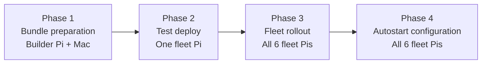

# Fleet Deployment Guide

Authoritative end-to-end guide for deploying the Speech Record Analysis system on the Raspberry Pi fleet. For a specific phase, jump to its dedicated document.

> **Audience.** You (the operator / researcher) preparing and rolling out the system to the six fleet Pis.
> **Assumption.** The fleet Pis have **no internet access** during and after deployment. All dependencies (Python wheels + system `.deb` packages) are staged on a separate connected "builder" Pi and shipped as a self-contained bundle.

## 1. Machines And Roles

| Role            | Hostname    | Reachable at                        | User          | Purpose                                                                                                                             |
| --------------- | ----------- | ----------------------------------- | ------------- | ----------------------------------------------------------------------------------------------------------------------------------- |
| Control machine | your Mac    | any network                         | your Mac user | Runs `rsync`, `deploy_bundle_to_fleet.py`, `configure_auto_start.py`. Holds the master bundle.                                      |
| Builder Pi      | `emotionpi` | `192.168.1.48` (during preparation) | `admin`       | Only Pi with internet. Downloads Python wheels and `.deb` packages so the fleet Pis never need internet. **Not part of the fleet.** |
| Fleet Pi 1      | `rpi5-11`   | `192.168.0.11`                      | `pi`          | Recording Pi. Two microphones. Offline.                                                                                             |
| Fleet Pi 2      | `rpi5-12`   | `192.168.0.12`                      | `pi`          | Recording Pi. Two microphones. Offline.                                                                                             |
| Fleet Pi 3      | `rpi5-13`   | `192.168.0.13`                      | `pi`          | Recording Pi. Two microphones. Offline.                                                                                             |
| Fleet Pi 4      | `rpi5-14`   | `192.168.0.14`                      | `pi`          | Recording Pi. Two microphones. Offline.                                                                                             |
| Fleet Pi 5      | `rpi5-15`   | `192.168.0.15`                      | `pi`          | Recording Pi. Two microphones. Offline.                                                                                             |
| Fleet Pi 6      | `rpi5-16`   | `192.168.0.16`                      | `pi`          | Recording Pi. Two microphones. Offline.                                                                                             |

The fleet mapping is the source of truth in [../devices.csv](../devices.csv). If the lab network reassigns addresses, update that file first — the deployment scripts read it directly.

## 2. Phase Overview

Do **not** skip Phase 2. Deploying to a single Pi first catches bundle problems (missing wheels, missing `.deb`, arch mismatch, config typos) before you touch the rest of the fleet.

Autostart is a **separate, opt-in phase**. Do not enable it until Phases 2 and 3 pass. Once autostart is on, systemd owns the mic processes and manual `START_AUDIO_PROCESSING.sh` runs will conflict.

## 3. Phase Summaries And Detail Links

Each phase has its own dedicated document with full commands, expected output, and troubleshooting. This section gives just enough context to know why you are doing each phase.

### Phase 1 — Bundle Preparation (on the builder Pi, then pull to Mac)

Detail: [Bundle_Preparation_on_Builder_Pi.md](Bundle_Preparation_on_Builder_Pi.md)

The builder Pi is the only machine with internet during preparation. It uses the same OS and CPU architecture as the fleet Pis (identical Raspberry Pi OS 64-bit / aarch64), so packages it downloads will install cleanly offline on the fleet.

You will run two scripts on the builder Pi:

- `./prepare_wheelhouse.sh` — downloads every Python dependency (`torch`, `funasr`, `modelscope`, ...) into `./wheelhouse/`.
- `./prepare_debs.sh` — downloads every system-level `.deb` package the audio stack needs (`portaudio19-dev`, `libportaudio2`, `libsndfile1`, `ffmpeg`, ...) into `./debs/`.

Both folders are then pulled to the Mac with `rsync`, giving the Mac a complete, self-contained bundle: `src/` + `models/` + `wheelhouse/` + `debs/`. The builder Pi's job is done and it can be unplugged.

### Phase 2 — Test Deployment on One Fleet Pi

Detail: [Test_Deployment_on_One_Pi.md](Test_Deployment_on_One_Pi.md)

Push the full bundle to just one fleet Pi (typically `rpi5-11` at `192.168.0.11`) and verify it end-to-end **without** enabling autostart yet.

Steps in short:

1. `./deploy_bundle_to_fleet.py --user pi --devices 1` — rsync bundle + run `install_from_bundle.sh` on the target Pi.
2. SSH in and verify:
   - both microphones are seen (`python strip_monitor.py --list-devices`),
   - the launcher runs (`./START_AUDIO_PROCESSING.sh`),
   - OSC telemetry lands on the Mac (`run_web.sh` on the Mac).
3. Only when all three pass, proceed to Phase 3.

If it fails, fix in one place (bundle or config) and re-run — this is the whole point of testing one Pi first.

### Phase 3 — Fleet Rollout via SSH

Detail: [Fleet_Deployment_via_SSH.md](Fleet_Deployment_via_SSH.md)

Once Phase 2 is green, roll the same bundle to all six Pis in one command.

Two equivalent commands:

- `./deploy_bundle_to_fleet.py --user pi --devices 1-6` — rsync + install on all six.
- `./deploy_lab_defaults.sh --skip-autostart` — same thing with lab defaults baked in.

At the end of Phase 3, every fleet Pi has the code, models, wheelhouse, and debs, and each Pi has `venv/` populated. The mic processes are **not** running yet.

### Phase 4 — Autostart Configuration (opt-in, after tests pass)

Detail: [Autostart_Configuration_on_Fleet.md](Autostart_Configuration_on_Fleet.md)

`python3 configure_auto_start.py --user pi` installs two systemd **user** services per Pi (`mic1`, `mic2`). After a reboot each Pi launches both mic processes automatically at boot, indefinitely.

Do this only after every fleet Pi passes the Phase 2 checks manually with `./START_AUDIO_PROCESSING.sh`. Once installed, use `systemctl --user start/stop/restart mic1 mic2` — do not run the launcher script manually anymore.

## 4. Post-Deployment: Normal Operation

After Phase 4 the operator no longer touches the Pis directly. Normal runtime is controlled from the Mac via `speech_control.py` and (optionally) the browser GUI. That workflow is documented in [pi_runtime_processing.md](pi_runtime_processing.md) and the operator command reference [operator_osc_control.md](operator_osc_control.md).

## 5. Troubleshooting Index

| Symptom                                                 | Where to look                                                                                                                  |
| ------------------------------------------------------- | ------------------------------------------------------------------------------------------------------------------------------ |
| `rsync` / `ssh` cannot reach a Pi                       | [Test_Deployment_on_One_Pi.md § Network sanity](Test_Deployment_on_One_Pi.md#1-network-sanity-check)                           |
| `install_from_bundle.sh` complains about missing `.deb` | [Bundle_Preparation_on_Builder_Pi.md § What debs are shipped](Bundle_Preparation_on_Builder_Pi.md#3-what-debs-are-shipped)     |
| Pi does not see the USB microphones                     | [Test_Deployment_on_One_Pi.md § Verify audio devices](Test_Deployment_on_One_Pi.md#3-verify-audio-devices)                     |
| OSC packets do not reach the Mac                        | [Test_Deployment_on_One_Pi.md § Verify OSC to Mac](Test_Deployment_on_One_Pi.md#5-verify-osc-stream-to-mac)                    |
| Autostart service will not start after reboot           | [Autostart_Configuration_on_Fleet.md § Verifying and debugging](Autostart_Configuration_on_Fleet.md#4-verifying-and-debugging) |

## 6. Script Reference

Full script/domain map: [script_map.md](script_map.md). The scripts touched by this guide are:

- `prepare_wheelhouse.sh` — build Python wheelhouse on builder Pi.
- `prepare_debs.sh` — download system `.deb`s on builder Pi.
- `deploy_bundle_to_fleet.py` — rsync bundle + run remote installer.
- `deploy_lab_defaults.sh` — one-shot wrapper with lab defaults.
- `install_from_bundle.sh` — offline installer that runs on each fleet Pi.
- `setup_pi.sh` — low-level venv+pip helper (called by `install_from_bundle.sh`).
- `configure_auto_start.py` — install systemd user services for autostart.
